# Squash the Creeps

## Main主场景Node

我们先添加一个地板，以防止角色掉落。要创建地板、墙壁或天花板等静态碰撞器，可以使用 [StaticBody3D](https://docs.godotengine.org/zh-cn/4.x/classes/class_staticbody3d.html#class-staticbody3d) 节点。它们需要 [CollisionShape3D](https://docs.godotengine.org/zh-cn/4.x/classes/class_collisionshape3d.html#class-collisionshape3d) 子节点来定义碰撞区域。

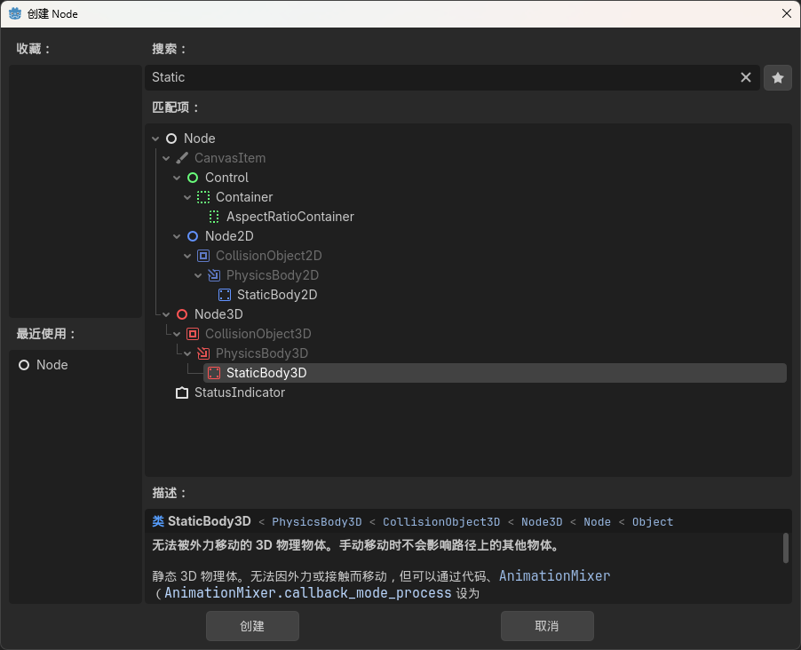

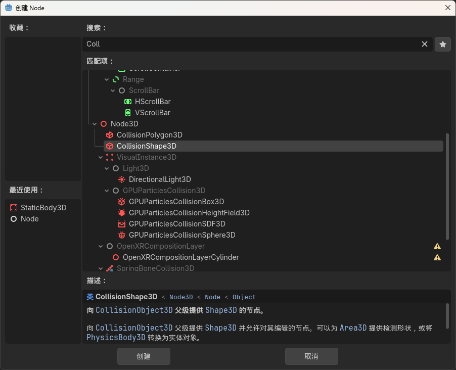

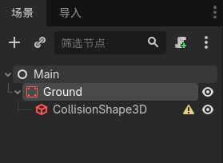

创建形状

盒子形状非常适合平坦的地面和墙壁。它的厚度使它能够可靠地阻挡甚至快速移动的物体。

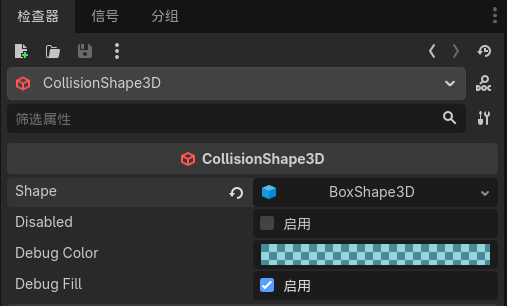

_Size_ 设置

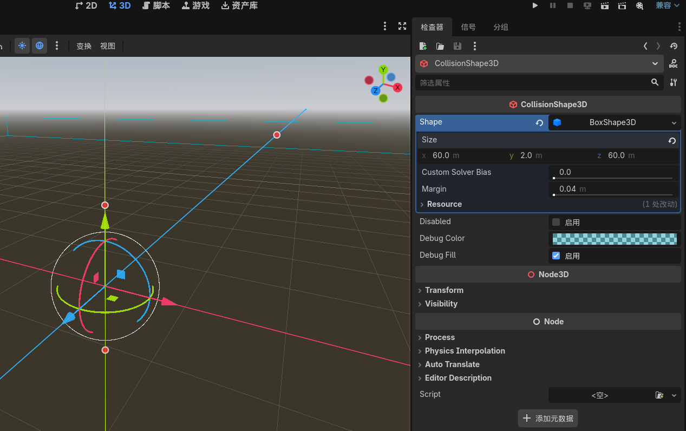

碰撞形状是不可见的。我们需要添加一个与之配套的视觉层。选择 `Ground`节点并添加一个 [MeshInstance3D](https://docs.godotengine.org/zh-cn/4.x/classes/class_meshinstance3d.html#class-meshinstance3d) 作为其子节点。

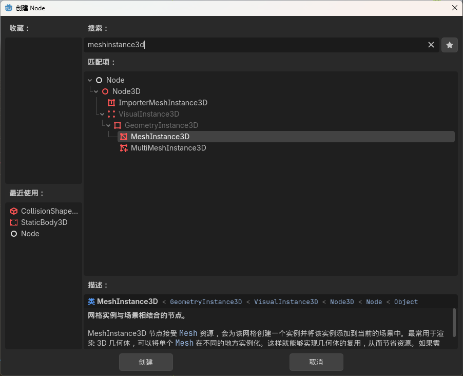

在*检查器*中，点击 _Mesh_ 旁边的字段，创建一个 [BoxMesh](https://docs.godotengine.org/zh-cn/4.x/classes/class_boxmesh.html#class-boxmesh) 资源，创建一个可见的立方体。

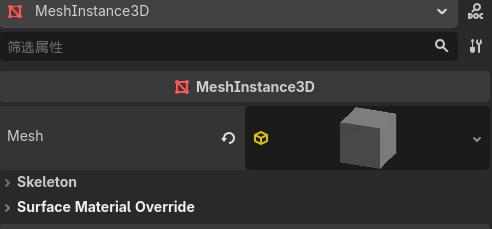

再次设置大小

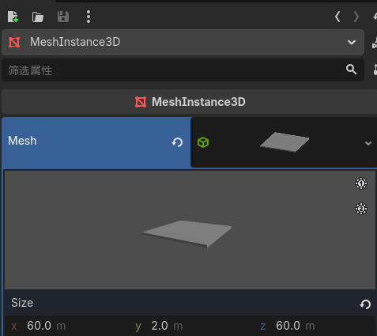

Ground

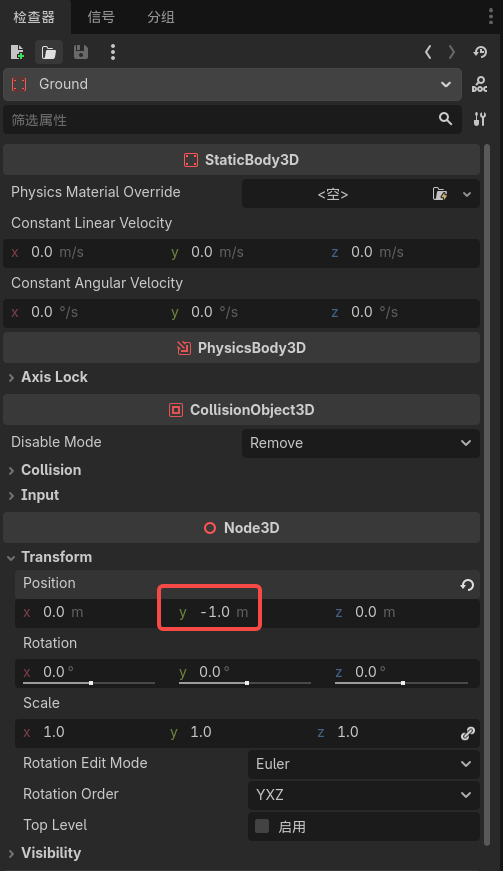

现在来添加一个平行光，让我们的整个场景不全都是灰色的。选择 `Main`节点，然后添加一个子节点 [DirectionalLight3D](https://docs.godotengine.org/zh-cn/4.x/classes/class_directionallight3d.html#class-directionallight3d)。

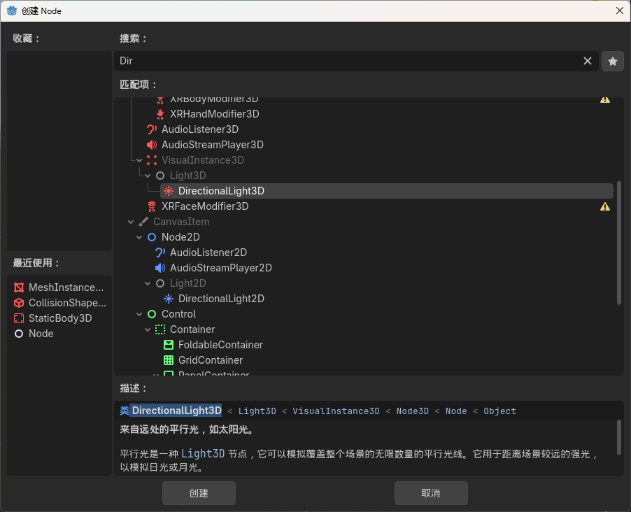

我们需要移动并旋转 [DirectionalLight3D](https://docs.godotengine.org/zh-cn/4.x/classes/class_directionallight3d.html#class-directionallight3d) 节点。通过单击并拖动操作器的绿色箭头将该节点往上移动，然后单击并拖动红色弧线以围绕 X 轴旋转它，直到地面被照亮。

在*检查器*中，点击复选框以启用*阴影*功能。

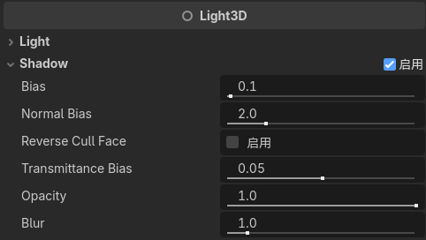

## 玩家场景

点击**其他节点**按钮，选择 `CharacterBody3D`节点类型，创建一个 [CharacterBody3D](https://docs.godotengine.org/zh-cn/4.x/classes/class_characterbody3d.html#class-characterbody3d) 作为根节点。

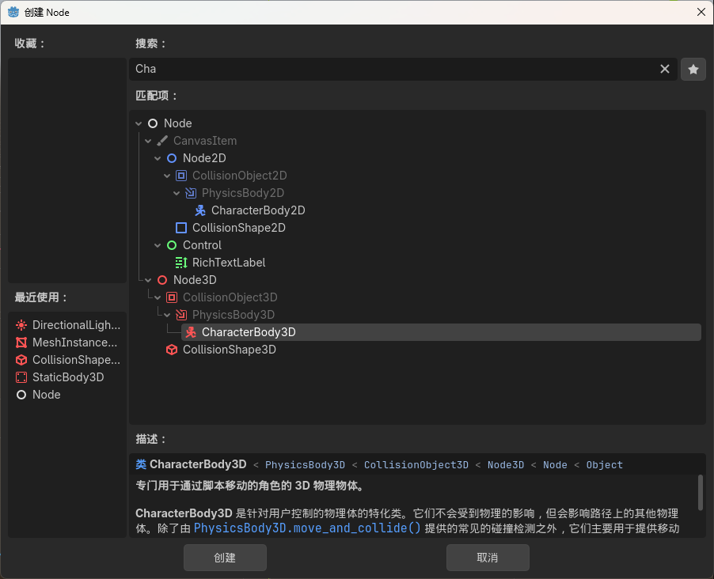

为 `Player`节点添加一个 [Node3D](https://docs.godotengine.org/zh-cn/4.x/classes/class_node3d.html#class-node3d) 子节点。

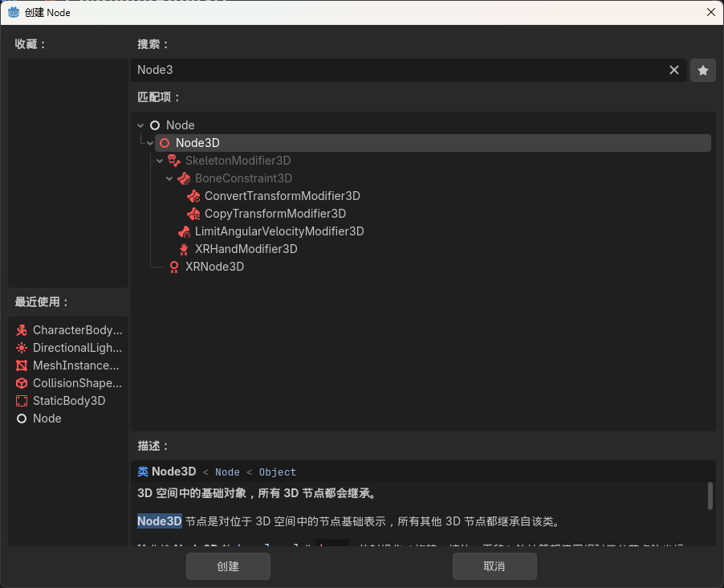

然后在文件系统面板中 `player.glb`拖放到 `Pivot` 节点上。改名为Character

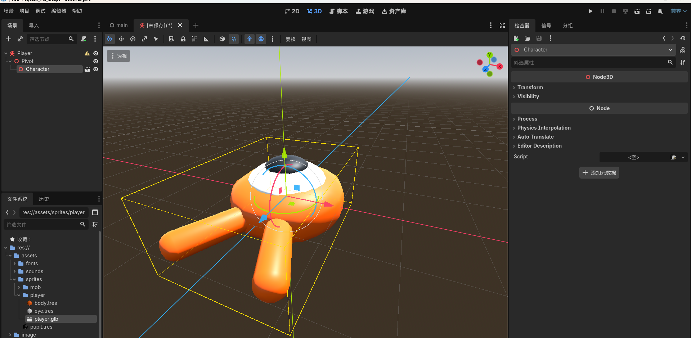

与所有物理节点一样，我们需要为角色添加一个碰撞形状，让其能与环境发生碰撞。再次选中 `Player` 节点，为其添加一个子节点 [CollisionShape3D](https://docs.godotengine.org/zh-cn/4.x/classes/class_collisionshape3d.html#class-collisionshape3d)。在**检查器**中，点击 **形状（Shape）** 属性，新建一个 [SphereShape3D](https://docs.godotengine.org/zh-cn/4.x/classes/class_sphereshape3d.html#class-sphereshape3d)。

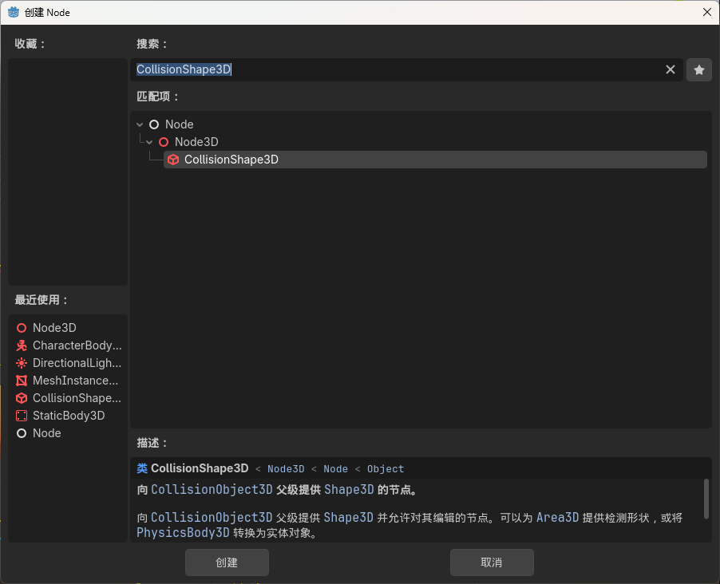

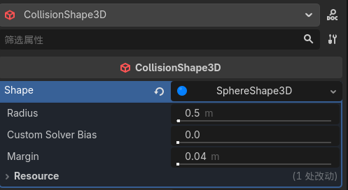

按键映射

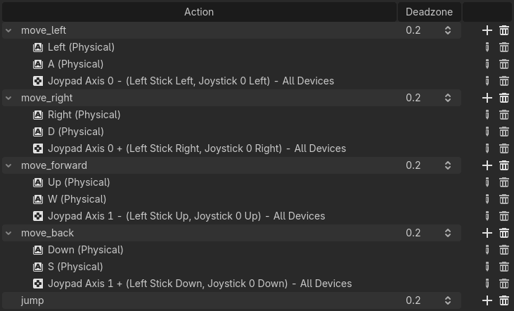

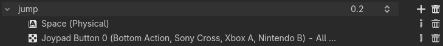
