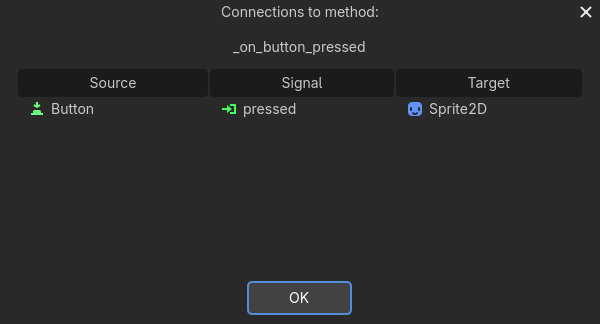

# GDScript

编写风格指南

https://docs.godotengine.org/zh-cn/4.x/tutorials/scripting/gdscript/gdscript_styleguide.html#doc-gdscript-styleguide

脚本示例1

```python
# 每个 GDScript 文件都是一个隐含的类。`extends` 关键字定义了这个脚本所继承或扩展的类
extends Sprite2D

# 定义变量
var speed = 400
# 常量大写
var angular_speed = PI

# 以下划线开头的是虚函数，可以覆盖的与引擎通信的内置函数
func _init():
	print("Hello, world!")

# 引擎和游戏开发者尽最大努力以恒定的时间间隔更新游戏世界和渲染图像，但在帧的渲染时间上总是存在着微小的变化。
# 这就是为什么引擎为我们提供了这个delta时间值，使我们的运动与我们的帧速率无关。
# 这个函数每一帧都会执行一次。delta 是两帧之间的时间间隔（通常约为 1/60 秒），用来确保运动在不同帧率下都能保持匀速。
func _process(delta):
	# 这里 rotation 是从 Sprite2D 所扩展的 Node2D 类继承的属性。它可以控制我们节点的旋转，以弧度为单位。
	# 改变旋转角度，物体的旋转角度每一帧都在增加。因为 angular_speed 是常量，所以物体会不停地原地自转。
	rotation += angular_speed * delta
	# 计算速度向量，velocity 变成了一个始终指向物体正前方的力。
	var velocity = Vector2.UP.rotated(rotation) * speed
	# 更新位置，由于物体一边旋转，一边向着旋转后的前方移动，它的运动轨迹最终会形成一个圆圈。
	position += velocity * delta
```

示例2

```python
extends Sprite2D

var speed = 400
var angular_speed = PI

# 手动控制移动
# 左右键（← / →）：负责改变角度（面朝哪里）。
# 上键（↑）：负责提供动力（往面朝的方向冲）。
# todo 增加倒车键,后退转向修正,侧移
func _process(delta):
	# 为 0 时物体保持当前角度不动。
	var direction = 0
	# 按下 ui_left：direction 变成 -1（逆时针旋转）。
	if Input.is_action_pressed("ui_left"):
		direction = -1
	# 按下 ui_right：direction 变成 1（顺时针旋转）。
	if Input.is_action_pressed("ui_right"):
		direction = 1
	# rotation 只有在 direction 不为 0 时才会改变。
	rotation += angular_speed * direction * delta
	# 每一帧开始时，velocity（速度）都重置为零向量
	var velocity = Vector2.ZERO
	# 只有当你按下 ui_up 时，它才会计算一个沿着当前面朝方向的速度。
	if Input.is_action_pressed("ui_up"):
		velocity = Vector2.UP.rotated(rotation) * speed
	# 位置更新：将速度应用到坐标。
	position += velocity * delta
```

.

## 信号

信号是节点在发生特定事件时发出的消息，例如按下按钮。其他节点可以连接到该信号，并在事件发生时调用函数。

信号是 Godot 内置的委派机制，允许一个游戏对象对另一个游戏对象的变化做出反应，而无需相互引用。使用信号可以限制[耦合](<https://zh.wikipedia.org/zh-cn/%E8%80%A6%E5%90%88%E6%80%A7_(%E8%A8%88%E7%AE%97%E6%A9%9F%E7%A7%91%E5%AD%B8)>)，并保持代码的灵活性。
例如，你可能在屏幕上有一个代表玩家生命值的生命条。当玩家受到伤害或使用治疗药水时，你希望生命条反映变化。要做到这一点，在 Godot 中，你会使用到信号。

从 Godot 4.0 开始，信号和方法（[Callable](https://docs.godotengine.org/zh-cn/4.x/classes/class_callable.html#class-callable)）一样，都成为了一等类型。这意味着你可以直接把信号当作方法的参数使用，无需以字符串的形式传参，这样能够更好地实现自动补全、更不容易出错。使用 Signal 类型能够直接实现的功能见 [Signal](https://docs.godotengine.org/zh-cn/4.x/classes/class_signal.html#class-signal) 类参考手册。

信号是 Godot 版本的观察者模式。

信号有很多用途。有了它们，你可以对进入或退出游戏世界的节点、碰撞、角色进入或离开某个区域、界面元素的大小变化等等做出反应。

source（signal） ---> Target（method）



示例, 增加一个buttion节点，进行点击开始/停止他旋转

```python
extends Sprite2D

var speed = 400
var angular_speed = PI


func _process(delta):
	rotation += angular_speed * delta
	var velocity = Vector2.UP.rotated(rotation) * speed
	position += velocity * delta


func _on_button_pressed():
	set_process(not is_processing())
```

.

示例，Sprite2D下增加一个定时器，让这个图标移动闪烁

```python
extends Sprite2D

var speed = 400
var angular_speed = PI

# 节点实例化之后执行，需要先配置1秒，自动开始
func _ready():
	# 用代码连接信号，而不用编辑器
	var timer = get_node("Timer")
	timer.timeout.connect(_on_timer_timeout)


func _process(delta):
	rotation += angular_speed * delta
	var velocity = Vector2.UP.rotated(rotation) * speed
	position += velocity * delta


func _on_button_pressed():
	set_process(not is_processing())


func _on_timer_timeout():
	# visible 属性是一个布尔值，用于控制节点的可见性。
	visible = not visible
```

自定义信号

```python
extends Node2D

# 假设您希望在玩家的生命值为零时通过屏幕显示游戏结束。
# 为此，当他们的生命值达到 0 时，您可以定义一个名为“died”或“health_depleted”的信号。
# 由于信号表示刚刚发生的事件，我们通常在其名称中使用过去时态的动作动词。
# 自定义信号与内置信号的工作方式相同：它们会显示在 Signals 标签页中，并且可以像其他信号一样进行连接。
# 信号还可以选择声明一个或多个参数。在括号之间指定参数的名称：signal health_changed(old_value, new_value)
signal health_depleted

var health = 10

# 要通过代码发出信号，请调用信号的 emit() 方法
func take_damage(amount):
	health -= amount
	if health <= 0:
		health_depleted.emit()
```

.

# C#

你必须使用 .NET版本的 Godot 编辑器才能在项目中使用 C# 进行编程
在 Godot 4 中用 C# 编写的项目目前无法导出到 Web 平台。

# GDExtension 技术提供的 C 和 C++

GDExtension 能够让你使用 C++ 编写游戏代码，无需重新编译 Godot。
如果要图性能，那么 GDExtension 便是最佳选择，不需要在整个游戏中都用到。这样，你仍可以用 GDScript 或 C# 来编写其他部分。

# 社区脚本
