# 编辑器

## 项目结构

**Godot 命名规范** 遵循 GDScript 风格指南，核心原则是**一致性**。
主要规则：文件和节点使用蛇形命名法（snake_case），类名使用帕斯卡命名法（PascalCase），变量/函数使用蛇形命名法（snake_case）。

**具体规范如下：**

- **文件与文件夹：** **采用** `snake_case.ext`。例如：`player_controller.gd`, `main_menu.tscn`。
- **类名 (Class_name)：** **采用** `PascalCase`（大驼峰）。例如：`PlayerController`。
- **节点 (Nodes)：** **采用** `snake_case` **或** `PascalCase`（主要基于个人喜好，但建议小写字母开头），例如：`player_sprite` **或** `PlayerSprite`。
- **变量与函数：** **采用** `snake_case`（小写下划线）。例如：`player_speed`, `get_damage()`。
- **常量与枚举：** **采用** `SCREAMING_SNAKE_CASE`（全大写下划线）。例如：`MAX_HEALTH`, `STATE_IDLE`。
- **信号 (Signals)：** **采用** `snake_case`，过去式。例如：`health_changed`, `button_clicked`。

参考，后期持续迭代优化

```plaintext
Project/
├── build/                              # 构建输出目录（忽略）
├── export_presets.cfg                  # 导出预设配置
├── .gitignore                          # git忽略
├── .editorconfig                       # 编辑器代码风格配置
├── .godot/                             # Godot 引擎缓存（忽略）
├── docs/                               # 项目文档
├── assets/                             # 游戏资源目录
│   ├── fonts/                          # 字体文件
│   ├── sounds/                         # 音乐音效文件
│   └── sprites/                        # 精灵图集
├── scenes/                             # 场景文件
│   ├── player/                         # 玩家场景
│   │   ├── player.tscn                 # 玩家场景实例
│   │   ├── player.gd                   # 玩家场景脚本
│   │   └── player.gd.uid               # 玩家场景脚本uid
│   ├── mob/                            # 敌人场景
│   │   ├── mob.tscn                    # 敌人场景实例
│   │   ├── mob.gd                      # 敌人场景脚本
│   │   └── mob.gd.uid                  # 敌人场景脚本uid
│   ├── hud/                            # 记分板场景
│   │   ├── hud.tscn                    # 记分板场景实例
│   │   ├── hud.gd                      # 记分板场景脚本
│   │   └── hud.gd.uid                  # 记分板场景脚本uid
│   ├── main.tscn                       # 主场景实例
│   ├── main.gd                         # 主逻辑脚本
│   └── main.gd.uid                     # 主逻辑脚本uid
├── icon.svg                            # 项目图标
├── project.godot                       # 项目配置文件
└── README.md                           # 项目说明
```

.

# [Node](https://docs.godotengine.org/zh-cn/4.x/classes/class_node.html#class-node)

检查器配置

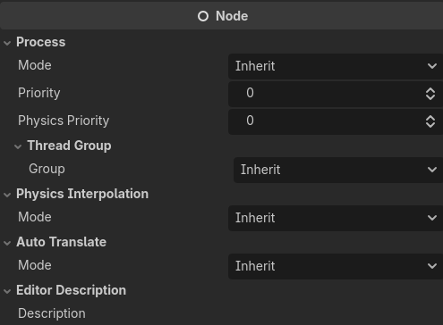

## [CanvasItem](https://docs.godotengine.org/zh-cn/4.x/classes/class_canvasitem.html#class-canvasitem)

检查器配置

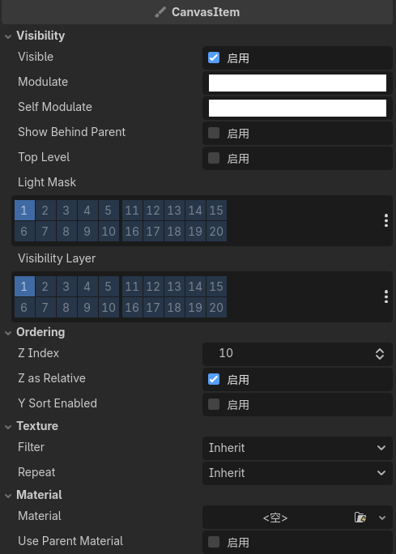

### [Node2D](https://docs.godotengine.org/zh-cn/4.x/classes/class_node2d.html#class-node2d)

检查器配置

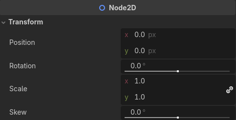

#### [AnimatedSprite2D](https://docs.godotengine.org/zh-cn/4.x/classes/class_animatedsprite2d.html)

检查器配置

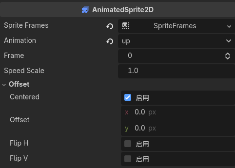

#### [CollisionShape2D](https://docs.godotengine.org/zh-cn/4.x/classes/class_collisionshape2d.html)

检查器配置

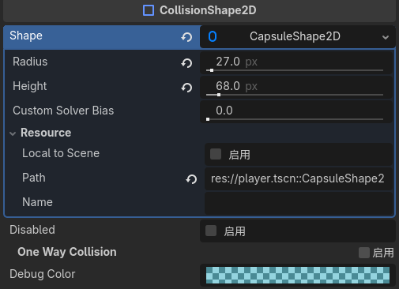

#### [CollisionObject2D](https://docs.godotengine.org/zh-cn/4.x/classes/class_collisionobject2d.html#class-collisionobject2d)

检查器配置

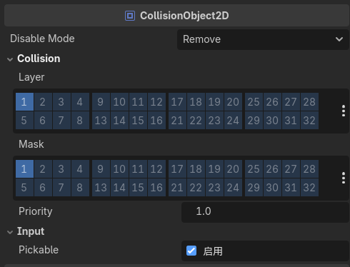

##### [Area2D](https://docs.godotengine.org/zh-cn/4.x/classes/class_area2d.html#class-area2d)

检查器配置

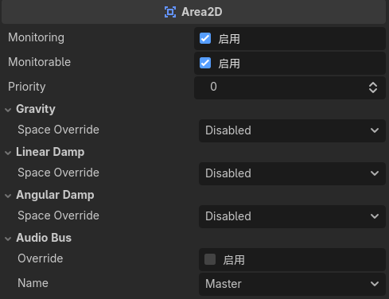

##### [RigidBody2D](https://docs.godotengine.org/zh-cn/4.x/classes/class_rigidbody2d.html)

父类：PhysicsBody2D https://docs.godotengine.org/zh-cn/4.x/classes/class_physicsbody2d.html

检查器配置

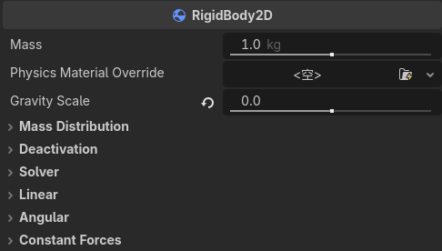

#### [GPUParticles2D](https://docs.godotengine.org/zh-cn/4.x/classes/class_gpuparticles2d.html)

检查器配置

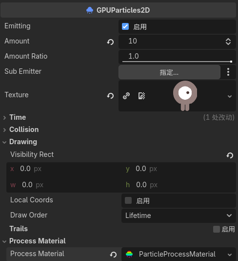

#### [VisibleOnScreenNotifier2D](https://docs.godotengine.org/zh-cn/4.x/classes/class_visibleonscreennotifier2d.html)

检查器配置

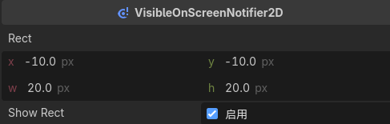

#### Marker2D

https://docs.godotengine.org/zh-cn/4.x/classes/class_marker2d.html

检查器配置

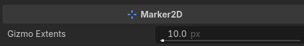

#### Path2D

https://docs.godotengine.org/zh-cn/4.x/classes/class_path2d.html

检查器配置

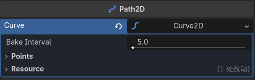

#### PathFollow2D

https://docs.godotengine.org/zh-cn/4.x/classes/class_pathfollow2d.html

检查器配置

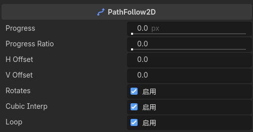

### [Control](https://docs.godotengine.org/zh-cn/4.x/classes/class_control.html)

检查器配置

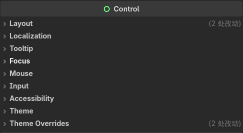

#### [Label](https://docs.godotengine.org/zh-cn/4.x/classes/class_label.html)

检查器配置

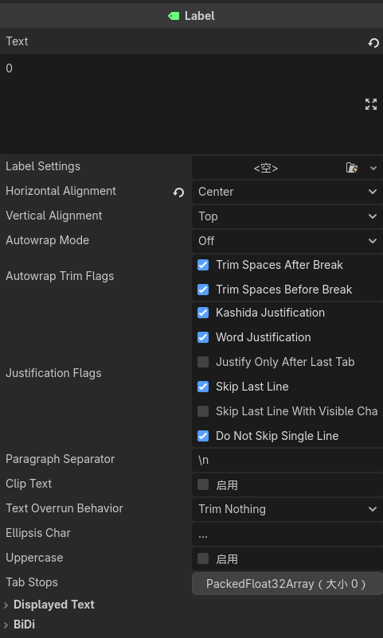

#### BaseButton

https://docs.godotengine.org/zh-cn/4.x/classes/class_basebutton.html

检查器配置

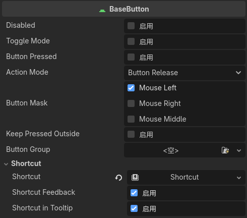

##### Button

https://docs.godotengine.org/zh-cn/4.x/classes/class_button.html

检查器配置

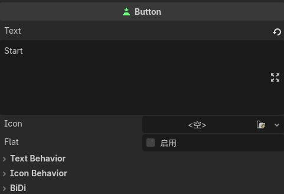

#### ColorRect

https://docs.godotengine.org/zh-cn/4.x/classes/class_colorrect.html

检查器配置

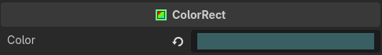

## [CanvasLayer](https://docs.godotengine.org/zh-cn/4.x/classes/class_canvaslayer.html)

检查器配置

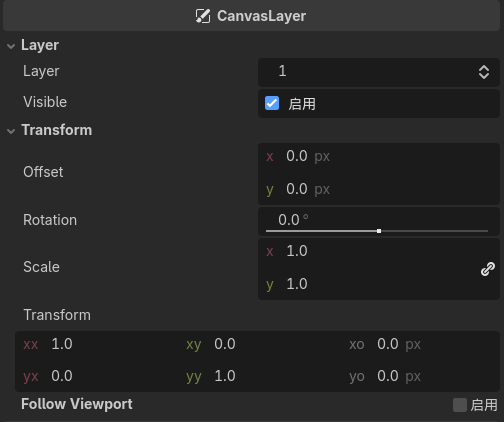

## Timer

https://docs.godotengine.org/zh-cn/4.x/classes/class_timer.html

检查器配置

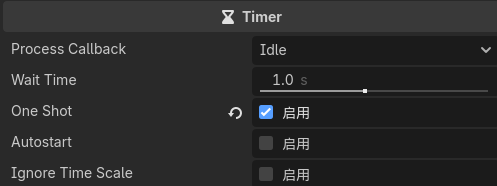

## AudioStreamPlayer

https://docs.godotengine.org/zh-cn/4.x/classes/class_audiostreamplayer.html

检查器配置

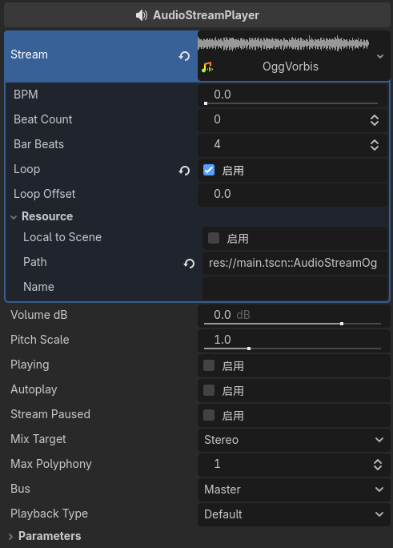
